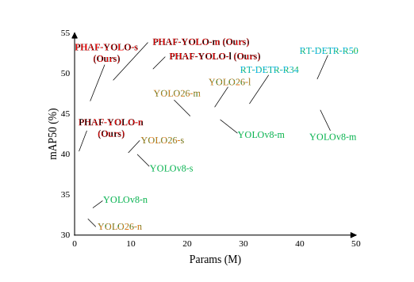

# PHAF-YOLO: Lightweight Progressive Multi-Kernel Enhancement and Hierarchical Adaptive Fusion for Real-Time Aerial Small Object Detection

### The code above will be unlocked upon acceptance of the paper.

  

## Abstract

Aerial small object detection is confronted with critical challenges including extreme scale variation, dense target distribution, heavy background interference, and strict real-time deployment constraints on UAV platforms. Traditional real-time detectors fail to balance detection accuracy and computational efficiency in such scenarios, suffering from severe cross-layer feature misalignment and tiny object feature attenuation caused by the mismatch between deep semantic features and shallow spatial features.

To address these issues, this paper proposes a lightweight real-time detection framework for aerial dense small objects, named **PHAF-YOLO**. Three targeted optimizations are designed:

* The **Progressive Multi-Kernel Enhancement Unit (PMKE)** is embedded in the backbone to expand the effective receptive field with low overhead and alleviate deep feature attenuation via progressive multi-kernel convolution.
* The **Hierarchical Dual-stage Adaptive Fusion Block (HDAF)** is applied in the neck to dynamically screen multi-scale features and suppress fusion redundancy through dual-stage adaptive fusion, improving cross-scale information utilization for dense small objects.
* The **Target-Centric Soft Regression Loss (TCSR Loss)** combines object-centered geometric constraints with soft target assignment to mitigate gradient instability from ambiguous positive-negative sample boundaries and boost high-IoU localization accuracy.

Extensive experiments on **VisDrone2019**, **UAVDT2018**, and **AI-TOD2021** demonstrate that PHAF-YOLO achieves a superior accuracy-efficiency trade-off across all model scales and outperforms mainstream real-time detectors. Ablation and validation experiments further verify the independent effectiveness and synergistic effect of all core modules.

The source code of this work is publicly available at:
https://github.com/csy001x/PHAF-YOLO
